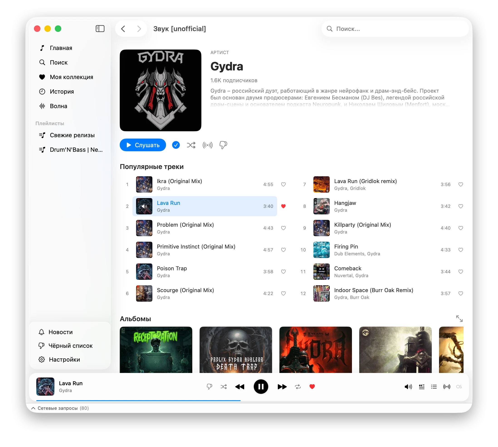

# Zvuk [unofficial]

Неофициальный десктопный клиент [Zvuk.com](https://zvuk.com) для macOS, написанный на SwiftUI.



## Возможности

- Просмотр артистов, альбомов, плейлистов
- Раздел «Популярное» — новинки, хиты, жанры, редакция
- Полноценное воспроизведение с управлением очередью
- Персональная Волна — радио по настроению
- Радио по треку — поиск похожей музыки
- Поиск по каталогу
- История прослушиваний
- Скробблинг в Last.fm
- Отображение текстов песен

## Требования

- macOS 15.0+
- Xcode 16+
- Swift 6
- [XcodeGen](https://github.com/yonaskolb/XcodeGen)

## Начало работы

```bash
# Клонировать
git clone https://github.com/korenskoy/yamp-zvuk-com.git
cd yamp-zvuk-com

# Сгенерировать проект Xcode
xcodegen generate

# Открыть в Xcode
open YAMP.xcodeproj
```

Соберите и запустите схему `YAMP`.

## Сборка DMG

```bash
./scripts/build-dmg.sh
```

## Дисклеймер

Это неофициальный клиент. Все права на контент принадлежат [Zvuk.com](https://zvuk.com). Проект не связан с компанией Zvuk и не одобрен ею.

## Лицензия

[MIT](LICENSE)
